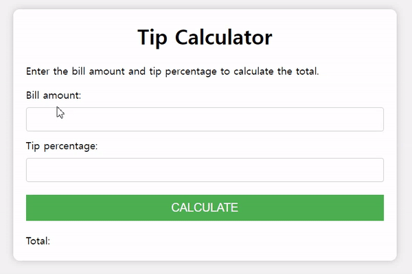

# Tip-Calculator


## 기능 
팁 계산기   

(1) 총 금액과 팁(%)를 입력하면  
(2) 총 금액에 팁을 포함하여 결과 출력   

## 학습
### JS : toFixed()  
숫자를 고정 소수점 표기법(fixed-point notation)으로 표시 
```
numObj.toFixed([digits]);
``` 
**digits**   
 <u>소수점 뒤에 나타날 자릿수.</u> 0 이상 20 이하의 값을 사용할 수 있으며, 구현체에 따라 더 넓은 범위의 값을 지원할 수도 있습니다. <u>값을 지정하지 않으면 0을 사용</u>합니다.

**반환 값**  
고정 소수점 표기법을 사용하여 나타낸 수를 문자열로 바꾼 값.

```
var numObj = 12345.6789;

numObj.toFixed(); // Returns '12346': 반올림하며, 소수 부분을 남기지 않습니다.
numObj.toFixed(1); // Returns '12345.7': 반올림합니다.
numObj.toFixed(6); // Returns '12345.678900': 빈 공간을 0으로 채웁니다.
(1.23e20).toFixed(2); // Returns '123000000000000000000.00'
(1.23e-10).toFixed(2); // Returns '0.00'
(2.34).toFixed(1); // Returns '2.3'
(2.35).toFixed(1); // Returns '2.4'. 이 경우에는 올림을 합니다.
-(2.34).toFixed(1); // Returns -2.3 (연산자의 적용이 우선이기 때문에, 음수의 경우 문자열로 반환하지 않습니다...)
(-2.34).toFixed(1); // Returns '-2.3' (...괄호를 사용할 경우 문자열을 반환합니다.)
```

## 학습 출처
**유튜브**      
https://www.youtube.com/@JavaScriptKing   

**JS**  
https://developer.mozilla.org/ko/docs/Web/JavaScript/Reference/Global_Objects/Number/toFixed    

**키워드**  
- toFixed